# Trailsight V2

Trailsight is a local investigation app. It helps an analyst explore unusual patterns in financial transactions. It organizes accounts and transactions that may deserve a closer look. It explains their place in the review queue and keeps the underlying facts visible.

The app uses artificial transaction data from IBM, not real customer data. It can also use artificial intelligence (AI). The AI writes an optional summary based only on facts supplied by the app.

Trailsight does **not** decide that money laundering happened. It does not calculate the probability that someone committed a crime. It does not block a payment or tell an analyst to file a report. A person must review the information and make the final judgment.

## Data and research credits

Trailsight builds on work created by IBM and the GARG-AML researchers. These sources deserve direct credit.

**AML** means anti-money laundering: the work of finding and investigating activity that may involve attempts to hide the illegal source of money.

### IBM: artificial transaction data

The transaction data comes from IBM's [AML-Data project](https://github.com/IBM/AML-Data), commonly called AMLworld. IBM generated the data inside a computer-made world of banks, people, and companies. The records are artificial. They are not real transactions with names removed.

Trailsight uses the **HI-Small** file from that project. HI-Small is IBM's name for this particular artificial transaction file. IBM includes hidden labels that act like an answer key for testing.

Trailsight keeps that answer key out of the running app. This means the pattern-finding calculation cannot use IBM's answers while producing its own results. The raw IBM file is not included in this repository. IBM publishes the data under the [CDLA-Sharing-1.0 license](https://spdx.org/licenses/CDLA-Sharing-1.0.html).

### GARG-AML: account-pattern research

**GARG-AML** stands for Graph-Aided Risk Guarding for Anti-Money Laundering. The account-pattern calculation in Trailsight is based on this research.

GARG-AML was created by Bruno Deprez, Bart Baesens, Tim Verdonck, and Wouter Verbeke. Credit goes to their [GARG-AML research paper](https://arxiv.org/abs/2506.04292) and [public source code](https://github.com/B-Deprez/GARG-AML).

In simple terms, GARG-AML turns transfers into a map. Accounts are points, and transactions connect those points. It looks at an account, the accounts directly connected to it, and the next layer of connections.

GARG-AML then measures whether that small part of the map resembles **smurfing**. Smurfing is a pattern in which money is moved through several accounts, often in smaller transfers, to make the trail harder to follow.

Trailsight uses the basic, undirected version of the GARG-AML calculation. Here, “undirected” means it studies whether accounts are connected without using the sending direction as a separate part of the score.

Trailsight ranks accounts that have enough connection data. It then places them into HIGH, MEDIUM, or LOW **review bands**, which help order an analyst's work. These bands are Trailsight's own review rules. They are not official rules from the GARG-AML authors, proof of money laundering, or probabilities.

Trailsight is the app in this repository that brings these pieces together. The IBM data and GARG-AML research remain the work of their original creators.

## How Trailsight works

```text
IBM's artificial HI-Small transactions
  -> a safe local database without IBM's hidden answers
  -> GARG-AML examines connections between accounts
  -> Trailsight saves daily results and orders items for review
  -> the app gathers the relevant facts for each investigation
  -> an optional AI summary explains those supplied facts
  -> the analyst reviews everything in the web interface
```

The server, web interface, and optional AI feature use the same saved facts. Normal application code calculates the counts, dates, amounts, account connections, review bands, and transaction priorities. The AI does not invent these facts.

Trailsight saves one set of account-pattern results for each day instead of recalculating them when a page opens. A past investigation therefore uses only information that was available by its stated date. The same prepared data and settings produce the same result.

### Key words used in the app

- **Account:** one Bank ID and Account ID from the artificial IBM data.
- **Directly connected account or counterparty:** an account that sent money to, or received money from, the selected account.
- **Review band:** HIGH, MEDIUM, or LOW placement used to order account reviews. An account with too little connection data is shown as **Insufficient Network Context**.
- **Transaction review priority:** a work-ordering label based on the saved review bands of the sender and receiver at that time.
- **Network Pattern Alert:** a record created when an account enters, or re-enters, the HIGH review band.
- **Detector cutoff:** the date and time when the GARG-AML result used on the page was calculated.
- **Supporting records:** the limited facts and transaction examples supplied for an investigation.
- **AI assessment:** an optional written summary of supplied facts. It does not replace those facts or the analyst's judgment.

## How Trailsight keeps IBM's test answers separate

IBM provides an `Is Laundering` field and separate pattern labels for checking the pattern-finding results. Think of these labels as the answer sheet for a test. Trailsight removes them before building the database used by the app. The pattern calculation, server, web interface, AI prompt, AI tools, and run logs cannot read them.

Only a separate test, run outside the app, may compare already-finished results with IBM's labels. In other words, Trailsight must produce its answer before it is allowed to look at IBM's answer.

IBM provides artificial Bank IDs but not customer locations. Trailsight consistently assigns a country to each artificial bank so routes can be shown on a map. “Bank Country” describes the bank in this artificial display. It does **not** describe where a customer lives, their nationality, or the risk of a country.

## Product screenshots

### Main pages

**Network Pattern Alerts.** This queue shows accounts placed in the HIGH review band. It also shows when the result was calculated, why the alert appeared, and whether a person has reviewed it.

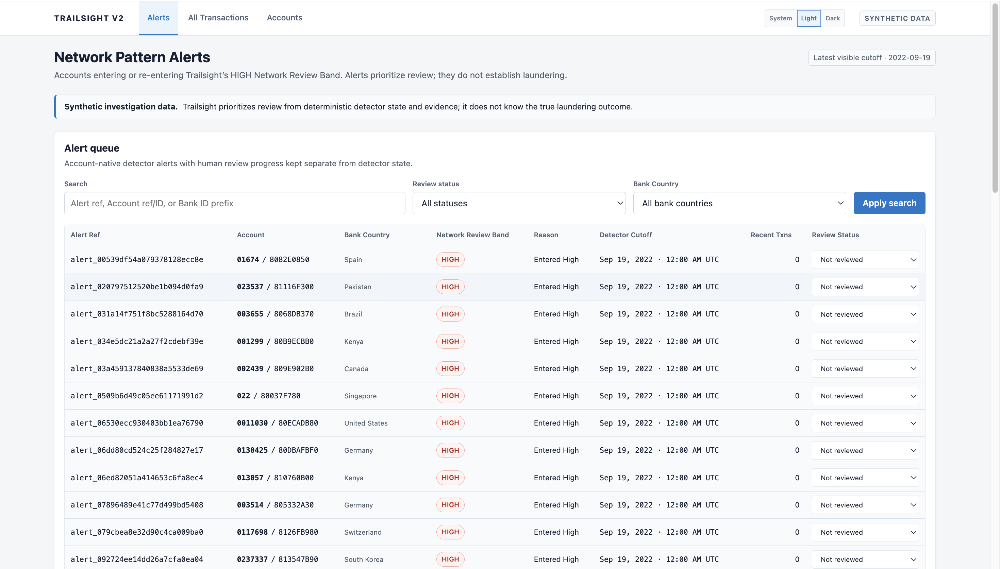

**Transaction browser.** Search and filters help an analyst find transfers and compare their date, sender, receiver, amount, currency, payment method, and review priority.

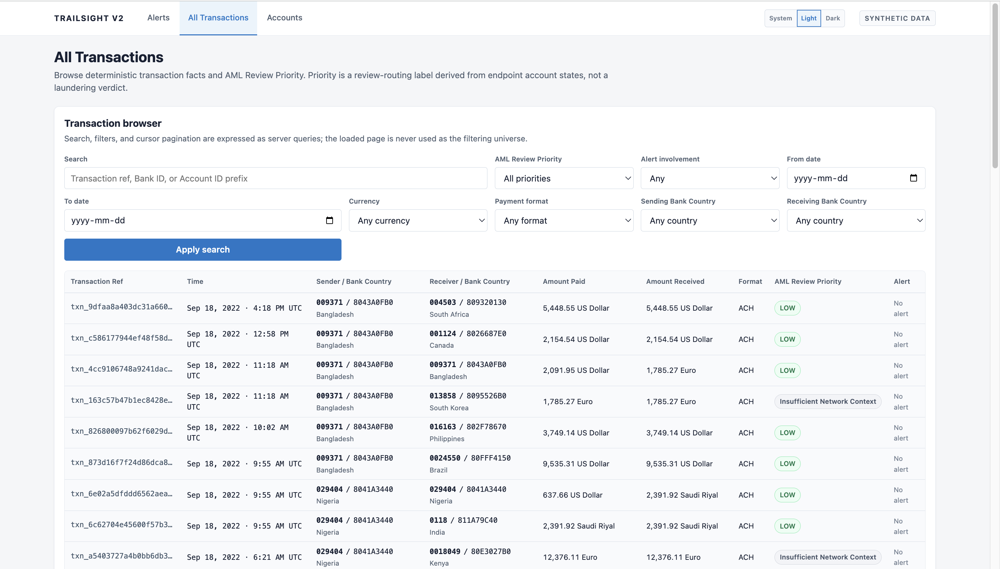

**Account directory.** Each row shows a consistent Bank and Account identity, its latest review band, and the number of incoming and outgoing transactions.

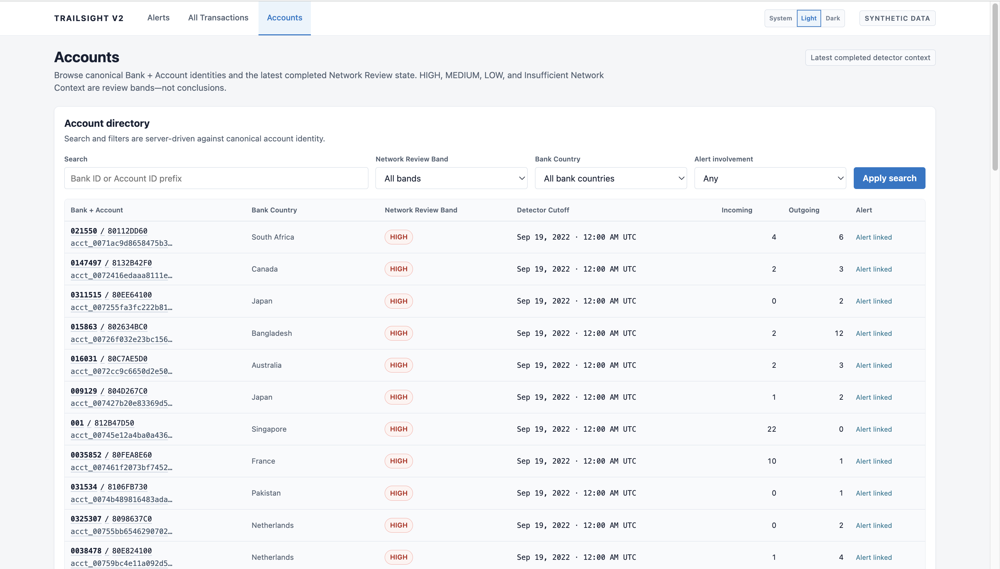

### Account investigation

**Account overview.** This view identifies the account and shows how highly it ranked for review. It also shows incoming transfers, outgoing transfers, and the number of other accounts involved. Money is compared only when the currencies match.

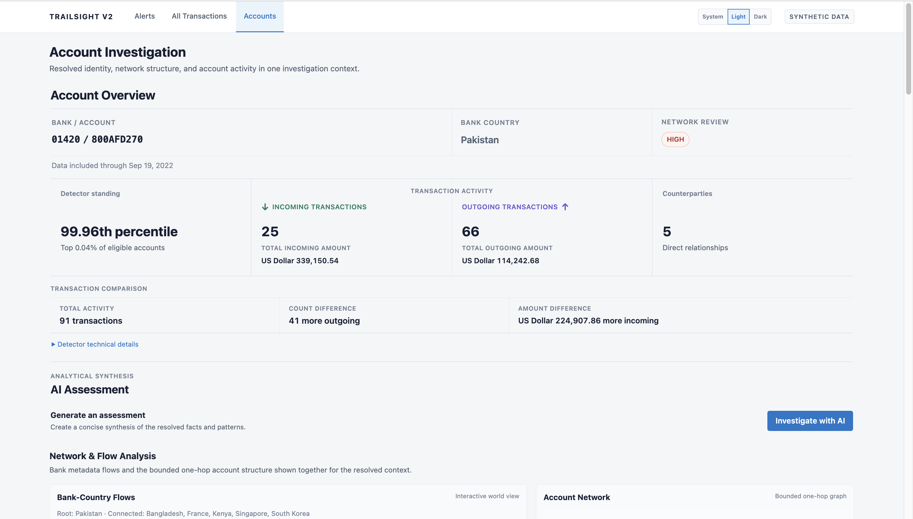

**Optional AI assessment.** The AI turns the facts supplied by Trailsight into a summary, key observations, possible patterns, and important limits. The analyst may ask one follow-up question about the same information.

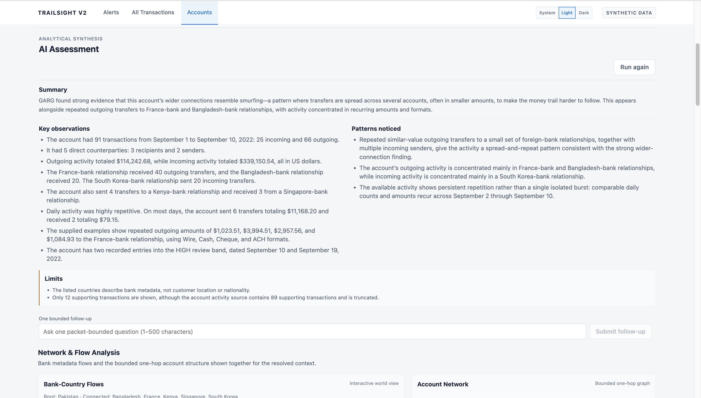

**Account connections and Bank-Country flows.** The map shows which artificial Bank Countries exchanged transfers. The account diagram shows the selected account and the accounts directly connected to it. Arrows show the direction of each transfer.

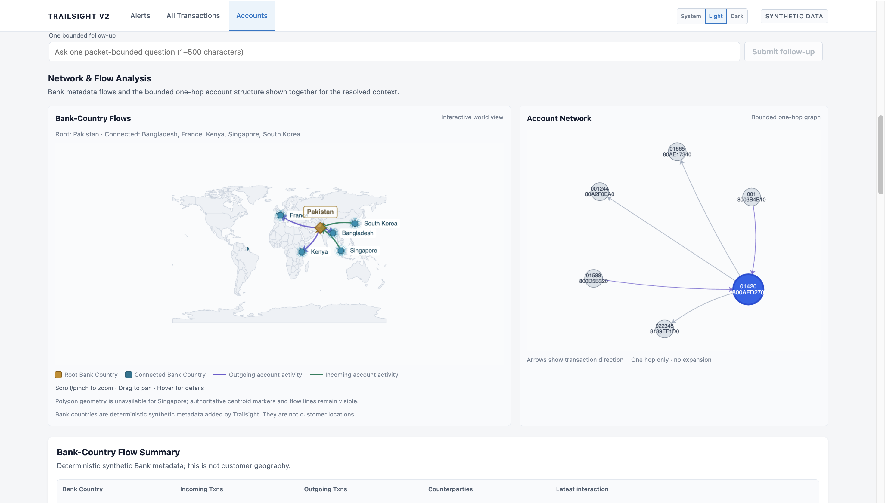

**Flow and relationship detail.** The tables and chart break activity down by Bank Country, currency, and directly connected account. Counts and money amounts remain separate so unlike currencies are never added together.

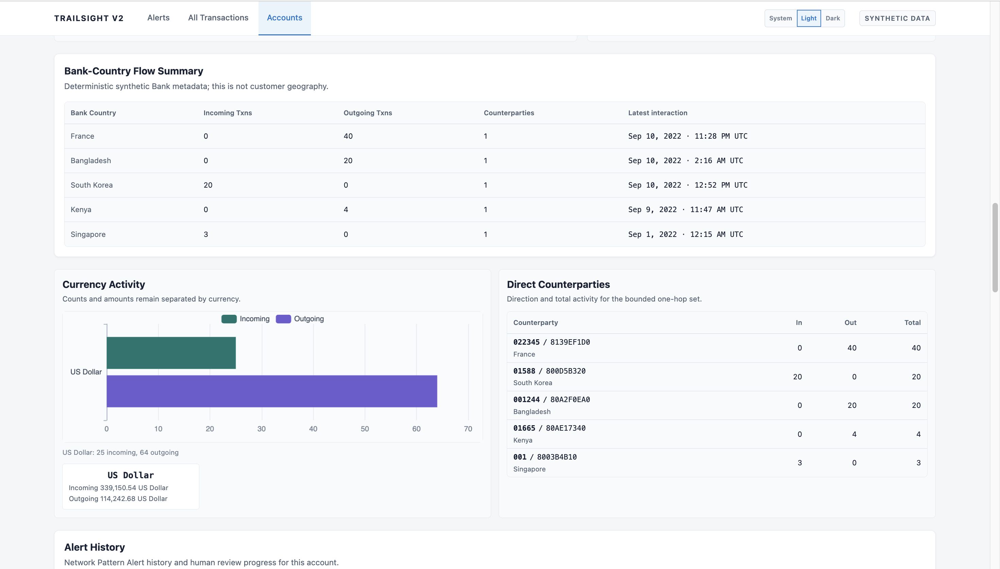

**Alert and transaction history.** The analyst can see when the account entered the HIGH review band and inspect the relevant transfers behind the account activity.

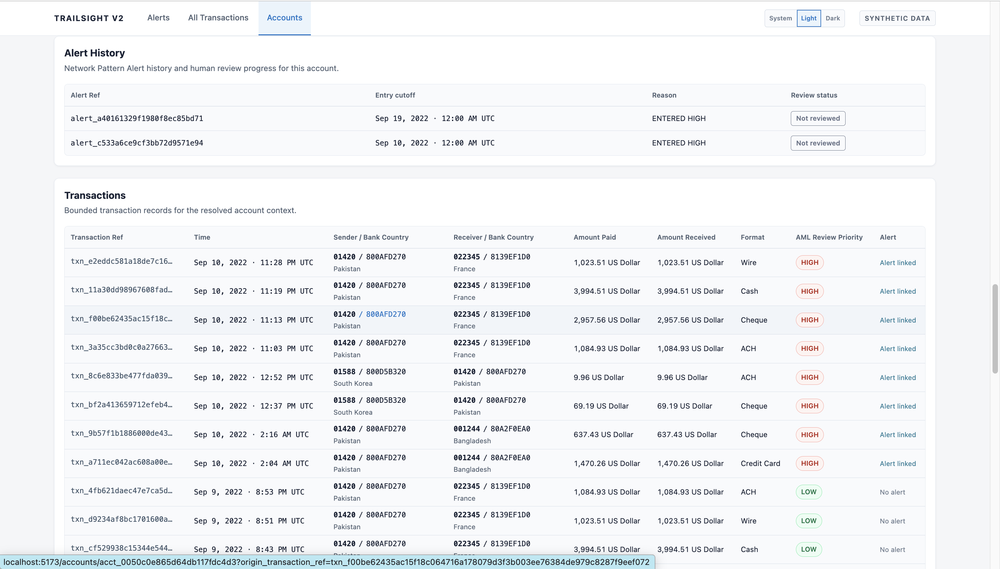

### Transaction investigation

**Transaction overview.** This view shows the transfer's review priority and explains how the sender's and receiver's account bands produced it. The map shows the route between the two artificial Bank Countries.

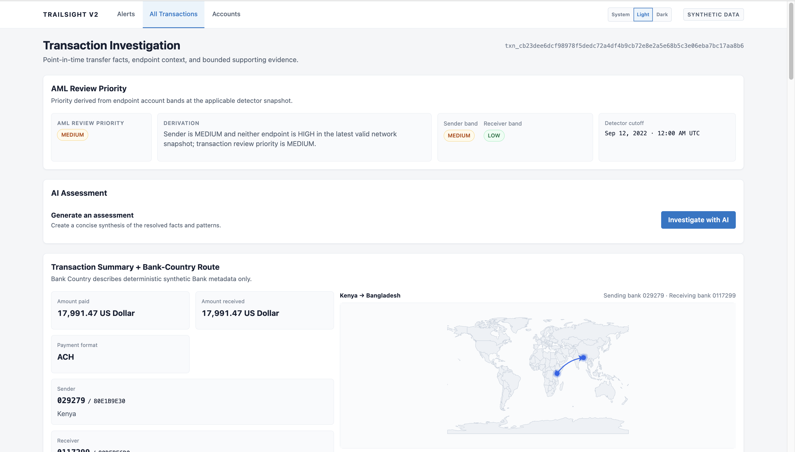

**Optional transaction AI assessment.** The AI explains the supplied transfer facts, lists useful observations, connects related facts into possible patterns, and states important limits.

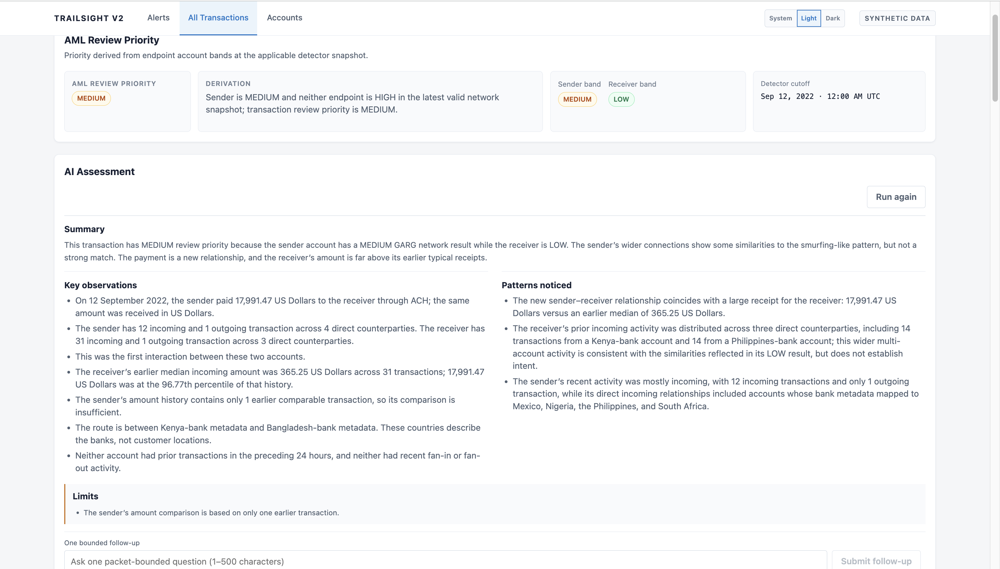

**Transfer facts and account information.** Exact transfer details appear first. The sender's and receiver's account information follows, using what was known at the time of the investigation.

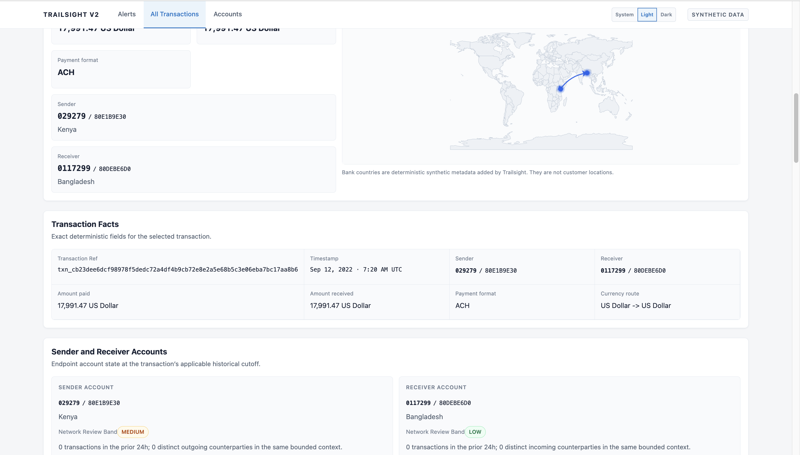

**Calculated investigation facts.** The app shows account bands, earlier amounts, previous interactions, recent transfer counts, and the currency route. Normal application code calculates these facts. They do not come from AI-generated text.

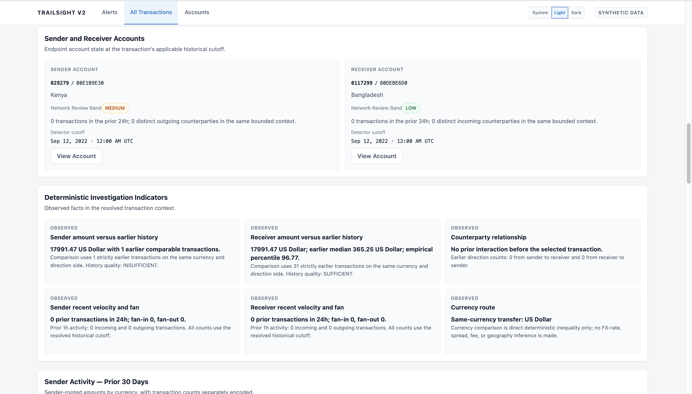

**Recent activity and account connections.** The chart shows the sender's previous 30 days of activity. The account diagram shows directly connected accounts. Amounts in different currencies are kept separate.

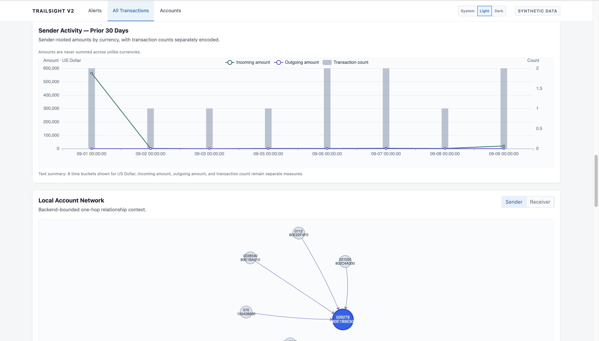

**Supporting records.** The final section lists the fact groups used by the investigation and the limited set of transaction rows supplied as supporting examples.

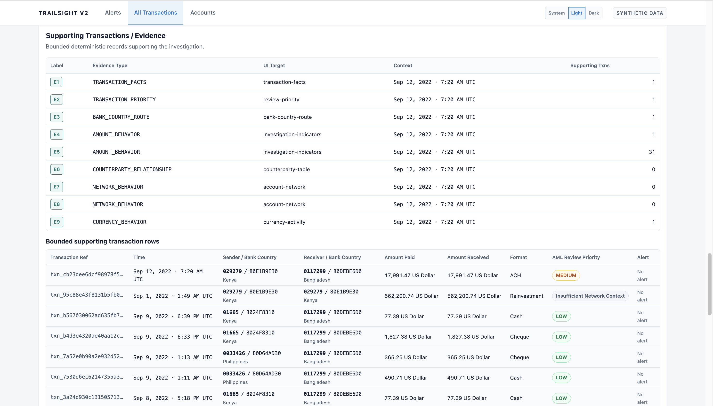

## What you need

The remaining sections are for people who want to run or inspect the project. You do not need them to understand the product overview above.

- Python 3.12 or newer
- [uv](https://docs.astral.sh/uv/) to install and run the Python parts
- Node.js `20.19+` or `22.12+`, plus npm, the tool that installs and starts the web interface
- the IBM AMLworld `HI-Small_Trans.csv` file when building the local database
- optionally, a private OpenAI API key and the name of an OpenAI model enabled for your project if you want AI summaries

The raw IBM data and the generated local database are intentionally not stored in this repository.

## One-time setup

```bash
cp .env.example .env
uv sync --frozen
npm --prefix frontend ci
```

The included `.env.example` file contains no secret information. Put local file paths and optional AI settings in `.env`. Git is configured not to include that file.

## Build the local database

Run this when the local database does not exist. Replace the example source path with the location of your IBM `HI-Small_Trans.csv` file. This step removes IBM's hidden answer fields. It then creates a local database using DuckDB, the database program used by Trailsight:

```bash
uv run python scripts/v2_data_prepare.py \
  --source /absolute/path/to/HI-Small_Trans.csv \
  --output data/v2/runtime/trailsight_v2.duckdb
```

Next, calculate and save the daily GARG-AML account results, Trailsight review bands, transaction priorities, and alerts:

```bash
uv run python scripts/v2_detector_prepare.py \
  --database data/v2/runtime/trailsight_v2.duckdb
```

These preparation commands run separately from the web app and may take a long time on the full dataset. Opening a page never starts this calculation. See the [technical data and GARG-AML guide](docs/02_DATA_AND_DETECTOR.md) for details.

## Start Trailsight

Open a terminal in the repository's main folder and start the Python server:

```bash
uv run uvicorn trailsight_v2.api.app:create_app \
  --factory \
  --env-file .env \
  --host 127.0.0.1 \
  --port 8000
```

Open a second terminal and start the web interface:

```bash
cd frontend
npm run dev
```

Open [http://127.0.0.1:5173](http://127.0.0.1:5173) in a browser. During local development, the web interface sends its data requests to the Python server on port 8000.

Use the [server health page](http://127.0.0.1:8000/api/v2/health) to check whether the Python server is ready. The server will refuse to start if the prepared database is missing or has the wrong structure.

For frontend work without the real Python server, start the clearly separated sample-data mode:

```bash
cd frontend
npm run dev:fixture
```

## Optional AI summaries

The app works without AI. An API key is a private code that allows the server to call OpenAI. To enable AI-written summaries, add the following values to the local `.env` file. That file belongs in the repository's main folder:

```text
OPENAI_API_KEY=<local secret>
TRAILSIGHT_MODEL=<exact API model identifier available to your project>
TRAILSIGHT_PROMPT_VERSION=investigation-v2
```

The health page reports `ai_configured: true` when both `OPENAI_API_KEY` and `TRAILSIGHT_MODEL` have values. The app checks the AI setup when an investigation starts. If AI is unavailable, the rest of the app still works. This includes lists, detail pages, the review process, charts, maps, and supporting facts.

Select **Investigate with AI** on an Account or Transaction page to create a summary. After a successful summary, the analyst may ask one follow-up question about the same supplied facts. A technical failure does not use up that follow-up.

For each AI run, the server writes one small technical log entry to `TRAILSIGHT_TRACE_PATH`. By default, this file is `data/traces/investigations-v2.jsonl`.

The log records the model and instructions used. It also records which limited app tools ran, timing, and AI input and output size. Finally, it records references to returned facts, whether required sections were present, and any error code.

The log does not store API keys, the conversation, private model reasoning, generated text, full supporting records, or IBM's hidden answers.

Keep the OpenAI API key only in the server's `.env` file. Never place it in `frontend/.env*` or in code sent to the browser. See the [official OpenAI API documentation](https://developers.openai.com/api/docs/quickstart).

## Check that the project works

Run the following checks:

```bash
uv run pytest tests/v2
uv run python evals/v2/run_non_live.py

cd frontend
npm ci
npm run test:contracts
npm run build
```

The automated AI check does not connect to OpenAI, need an API key, or make a paid model call. It uses a fake AI service made only for tests. A person must separately check one summary from the real AI service.

## Important limits

- Trailsight is a local demonstration project designed to run as one server process. It is not a multi-server production system.
- It has no sign-in system, user accounts, public hosting setup, or tools for managing a cloud service.
- An alert moves from **Not reviewed** to **In review** to **Reviewed**. A reviewed alert cannot be moved backward.
- GARG-AML review bands only help order an analyst's work. They are not probabilities and do not prove money laundering.
- The transaction activity chart always shows the sender's previous 30 days.
- An Account Network diagram shows the selected account and no more than 24 directly connected accounts. The page states when more accounts exist.
- The optional AI receives no more than 12 directly connected accounts and only limited supporting examples.
- The Account Bank-Country map and table include all country-level connections available for the selected account and date.
- Alert History shows the latest 100 entries and states when older entries exist.
- The AI feature answers questions only about the supplied investigation facts. It is not a general chatbot, and it allows one successful follow-up.

## Detailed technical documentation

These files are for readers who want implementation details:

- [What the product promises](docs/00_PRODUCT_CONTRACT.md)
- [How the parts fit together](docs/01_SYSTEM_ARCHITECTURE.md)
- [How the data and GARG-AML calculation are prepared](docs/02_DATA_AND_DETECTOR.md)
- [How investigation facts are organized (called Evidence V2 in the code)](docs/03_DOMAIN_AND_EVIDENCE.md)
- [How other software can request data from Trailsight (REST API and MCP)](docs/04_API_AND_MCP.md)
- [How the AI is limited and checked](docs/05_AI_AND_EVALUATION.md)
- [How the web interface is designed](docs/06_FRONTEND_UX.md)
- [How to start and configure the app](docs/07_RUNTIME_AND_DEPLOYMENT.md)
- [How the project is tested](docs/08_TESTING_AND_ACCEPTANCE.md)

`docs/09_IMPLEMENTATION_ROADMAP.md` and `docs/implementation/` preserve the project's implementation history. They are not instructions for starting or releasing the app.
