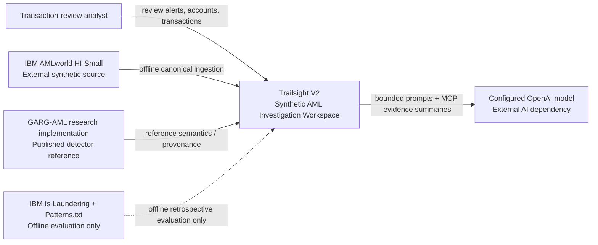
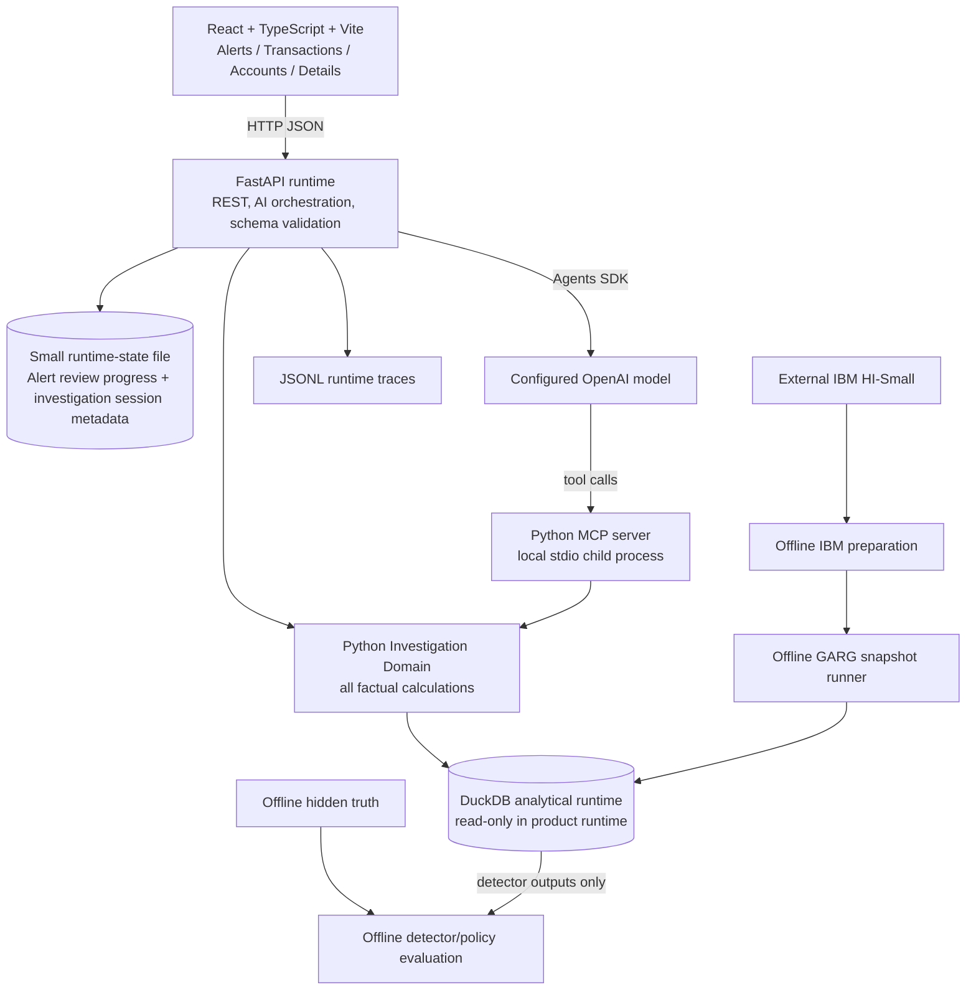

# TRAILSIGHT V2 — SYSTEM ARCHITECTURE

## 1. Executive architecture decision

Trailsight V2 uses Python, DuckDB, FastAPI, React/TypeScript/Vite, one bounded stdio MCP server, the OpenAI Agents SDK, deterministic Evidence V2, structured AI output, JSONL telemetry, and pytest. It replaces the former transaction-case domain with an account/network-native AML investigation domain. The release-candidate run path is direct `uv` + Vite/npm; Docker is not a required or maintained runtime path.

The system is split into two operating planes:

### Offline preparation/detector plane

```text
External IBM HI-Small
        |
        v
Runtime-safe canonical ingestion
        |
        +--> deterministic bank-country enrichment
        |
        v
Daily cumulative historical graphs
        |
        v
GARG-AML deterministic core
        |
        v
Persisted account detector states
        |
        +--> label-blind Network Review Bands
        +--> transaction snapshot/priority states
        +--> Network Pattern Alerts
        v
Immutable runtime analytical DuckDB
```

### Interactive runtime plane

```text
React / Vite
     |
     v
FastAPI
     |
     +--> Deterministic Investigation Domain --> read-only analytical DuckDB
     |
     +--> small writable review-progress state
     |
     +--> AI Investigation Runner
               |
               v
        one local stdio MCP server
               |
               v
        same deterministic domain
               |
               v
          configured LLM

FastAPI --> JSONL traces
```

Heavy GARG work never runs from an HTTP/MCP request.

## 2. C4 Level 1 — System Context



Boundary rule: the `Hidden` path never joins runtime product data.

## 3. C4 Level 2 — Containers



The runtime-state file is deliberately separate from the reproducible analytical DuckDB. It stores only small mutable operational state: Network Pattern Alert review progress and the minimal investigation-session mapping needed to enforce one bounded follow-up across app restarts. It stores no chat transcript, model reasoning, AML disposition, or IBM hidden truth.

## 4. Solution strategy

1. **Canonicalize first.** IBM raw identifiers are normalized into V2 canonical account/transaction references before detector work.
2. **Precompute heavy graph state.** Daily cumulative GARG snapshots are an offline build artifact.
3. **Materialize review-critical joins.** Transaction-to-snapshot association, endpoint bands, priority, and alert events are persisted instead of recomputed per page request.
4. **Keep cheap investigation analytics deterministic/on demand.** Historical amount context, relationship history, bounded neighborhoods, velocity, fan-in/out, currency and bank-country context are queried for the selected subject and cutoff.
5. **One domain source of truth.** API and MCP call the same Python investigation services.
6. **Application-owned evidence.** AI receives bounded projections and cites IDs generated by deterministic code.
7. **Point-in-time context everywhere.** Account detail opened from an alert or transaction carries an explicit historical investigation context; direct account browsing uses the latest completed snapshot.
8. **Keep runtime local and small operationally.** One FastAPI process, one read-only analytical DuckDB, one tiny writable state path, one trace path, one Vite frontend process for local development, and one optional external model API.

## 5. Major building blocks

### IBM Data Foundation

Owns runtime-safe ingestion, canonical IDs, bank metadata, canonical transactions/accounts, source provenance, and the label firewall.

### Detector & Priority Pipeline

Owns GARG graph snapshots, account scoring, rank/bands, transaction priority, account alerts, detector support facts, and offline detector evaluation.

### Investigation Domain

Owns all factual historical/context calculations and Evidence V2 creation/resolution.

### FastAPI Application

Owns paginated resources, review-status mutation, subject-detail endpoints, AI orchestration endpoint registration, and safe error mapping. Vite serves/proxies the local frontend during development; production compilation is validated separately.

### MCP Boundary

Owns only the seven approved bounded model-facing tools. It is an adapter over the Investigation Domain, not another query engine.

### AI Investigation

Owns prompt/model configuration, tool-use orchestration, structured analyst summaries, bounded follow-up, evals, and telemetry. The deterministic investigation packet is the AI trust boundary.

### React Frontend

Owns navigation and five frozen V2 views. It never calculates authoritative AML/detector facts.

## 6. Runtime flows

### 6.1 Alert investigation

```text
Alerts page
  -> open Network Pattern Alert
  -> Account Detail at alert snapshot
  -> deterministic account state + activity + one-hop network
  -> optionally open transaction
  -> optionally run AI
  -> display the parsed analyst summary
  -> update review progress
```

### 6.2 Transaction investigation

```text
Transaction search/detail
  -> persisted applicable detector snapshot
  -> persisted endpoint bands + transaction priority
  -> deterministic activity/relationship indicators at T
  -> bank-country route
  -> bounded local network
  -> optional AI tool selection/synthesis
  -> display the parsed analyst summary
```

### 6.3 Direct account browse

```text
Accounts page
  -> latest completed detector state
  -> account detail using latest completed snapshot cutoff
  -> account activity, relationships, transactions, alerts
```

### 6.4 Offline detector build

```text
raw runtime-safe transactions
  -> daily cutoff list
  -> cumulative canonical graph
  -> GARG community preprocessing + score
  -> scoring eligibility
  -> rank/band
  -> persisted snapshot/account state
  -> transaction historical snapshot association
  -> priority
  -> alert transitions
```

### 6.5 Offline benchmark evaluation

```text
persisted label-blind outputs
       +
raw Is Laundering / Patterns.txt
       |
       v
isolated evaluation job
       |
       v
aggregate evaluation reports only
```

The output never feeds back into review-band thresholds during V2.

## 7. Historical context model

Trailsight distinguishes two times:

- **detector cutoff**: the latest valid GARG snapshot `<=` the subject transaction/context time;
- **investigation context time**: the exact transaction timestamp, alert snapshot cutoff, or latest-completed snapshot cutoff used for ordinary historical facts.

For a selected transaction at `T`:

- GARG state comes from the latest persisted snapshot cutoff `<= T`;
- historical behavioral evidence uses transactions strictly `< T`;
- the selected transaction itself may be displayed/highlighted but is not part of its own prior history;
- no later transaction may appear.

For an alert:

- detector and ordinary historical context use the originating alert snapshot cutoff.

For an account opened from a transaction:

- account page context is anchored to that transaction and may display the selected transaction as the current item while keeping prior-history calculations `< T`.

## 8. V1 reuse / change / delete matrix

| V1 capability/concept | V2 action | Rationale |
|---|---|---|
| Python project/tooling | REUSE | Proven foundation |
| DuckDB | REUSE | 5M rows + analytical access fits local use |
| FastAPI | REUSE | Resource/API boundary remains suitable |
| React + TypeScript + Vite | REUSE | V2 is richer but same web stack |
| stdio MCP server pattern | REUSE | Good bounded local AI capability boundary |
| OpenAI Agents SDK integration | REUSE | Tool orchestration pattern remains valid |
| deterministic evidence IDs | REUSE PATTERN | Evidence types/subjects change completely |
| evidence-reference validation | REUSE | Core grounding control |
| structured AI output | REUSE | Extend with detector/fact/interpretation distinction |
| AI eval harness | REUSE/EXTEND | New V2 scenarios and leakage/wording tests |
| JSONL telemetry | REUSE | Extend context fields |
| Historical Docker one-unit pattern | DELETE | The prior entrypoint served V1 and no valid V2 container/static-serving path is maintained |
| pytest/integration test patterns | REUSE | Contracts change, infrastructure valuable |
| `Case` / `case_ref` primary domain | DELETE | V2 is alert/account/transaction-native |
| curated `cases.yaml` navigation | DELETE | All data is browseable |
| TransXion ingestion/runtime | DELETE | IBM HI-Small only |
| Person/Merchant entity type | DELETE | Not available/needed |
| Synthetic Region | DELETE | Replaced by synthetic Bank Country enrichment |
| sender-only investigation | REPLACE | V2 investigates both endpoint accounts |
| V1 MCP tools | REPLACE | New V2 alert/account/network semantics |
| V1 evidence types | REPLACE | New V2 evidence model |
| V1 one-screen UI | REPLACE | Five frozen V2 views |

Dead V1 domain code has been removed after V2 package integration and regression coverage established the replacement import graph.

## 9. Cross-cutting concepts

### Ground-truth isolation

Runtime schemas and object models do not contain IBM truth fields. Offline evaluation receives them through a separate configuration/path.

### Point-in-time correctness

Every detector/behavior service requires an explicit context time/snapshot derived from the subject. No method may default silently to future/latest state when a historical context is supplied.

### Provenance

Persist source file checksum, source dataset version, identity-rule version, bank-country mapping version, detector code/config version, and snapshot cutoff.

### Boundedness

Pagination, one-hop graph bounds, supporting-transaction bounds, MCP payload limits, and one follow-up prevent accidental multi-million-row or open-ended AI paths.

### Model configuration

The model and prompt version remain environment/config choices, not architecture constants.

### Human workflow state

Only alert progress is mutable operational product state. Detector outputs remain immutable.

## 10. Primary ADR summary

### ADR-01 — IBM HI-Small only
Decision: one simulation for V2. Consequence: coherent identity/state, bounded compute, no cross-simulation complexity.

### ADR-02 — DuckDB
Decision: retain DuckDB for 5.08M-row local analytical runtime. Consequence: no database service; detector outputs can be materialized beside transactions.

### ADR-03 — Bank+Account canonical identity
Decision: `(source_dataset, bank_id, account_id)`. Consequence: corrects account collisions and changes graph topology versus Account-only loader.

### ADR-04 — Deterministic bank-country enrichment
Decision: versioned stable hash of Bank ID into risk-neutral country metadata. Consequence: map is reproducible bank metadata, never customer geography.

### ADR-05 — GARG over pretrained GNN
Decision: GARG deterministic core. Consequence: interpretable, no model serving/training; narrower smurfing-oriented coverage is explicit.

### ADR-06 — No model training
Decision: no downstream trees, boosting, Isolation Forest, GNN fitting, or tuning. Consequence: runtime detector behavior is reproducible and label-blind.

### ADR-07 — Daily cumulative detector snapshots
Decision: one cumulative historical state per day boundary. Consequence: reproducible point-in-time correctness; detector state may lag by one cadence interval.

### ADR-08 — Top-1% / next-4% review policy
Decision: rank eligible accounts within each snapshot. Consequence: operational capacity policy, not AML threshold/probability.

### ADR-09 — Account-native Network Pattern Alerts
Decision: alert on HIGH entry/re-entry. Consequence: detector-native queue without fabricating transaction alerts/cases.

### ADR-10 — Transaction priority inheritance
Decision: deterministic endpoint-state matrix. Consequence: transparent triage metadata; not GARG edge prediction.

### ADR-11 — Ground-truth firewall
Decision: runtime never contains `Is Laundering` or `Patterns.txt`. Consequence: hidden truth is available only to isolated retrospective evaluation.

### ADR-12 — Account graph and world map are separate views
Decision: both retained. Consequence: graph answers relationship question; map answers synthetic bank-country route question.

### ADR-13 — Bounded MCP
Decision: seven narrow tools over deterministic services. Consequence: no SQL/general graph/database access for the model.

### ADR-14 — Deterministic facts outside LLM
Decision: Python owns all authoritative calculations. Consequence: AI selects/synthesizes evidence rather than creating facts.

### ADR-15 — One-container runtime
Decision: React static build + FastAPI + local MCP child; mounted analytical DB. Consequence: low operational cost and simple local demo.

### ADR-16 — Chat-driven modular implementation
Decision: bounded replacement packages with strict ownership/shared contracts and explicitly authorized parallel ZIP lineages. Consequence: independent low-collision lanes may progress in parallel, but every merge point and downstream authoritative ZIP is named in `09_IMPLEMENTATION_ROADMAP.md`; implementation chats still return scoped replacement files rather than redesigning the repository.

## 11. Architecture quality review

- **Security/data isolation:** hidden truth is excluded structurally, not only by prompt.
- **Reliability:** deterministic UI remains useful when AI fails.
- **Historical integrity:** persisted snapshots and explicit context times prevent look-ahead.
- **Performance:** expensive graph scoring precomputed; runtime uses bounded DuckDB reads.
- **Cost:** no paid DB/monitoring/cloud requirement; model usage bounded.
- **Operational simplicity:** one runtime container, one analytical DB, one small writable runtime-state file.
- **Testability:** detector parity, snapshot mappings, domain facts, MCP projections, AI grounding and frontend contracts are independently testable.

# EXPLAIN TRAILSIGHT V2 TO ME SIMPLY

## Where does the IBM data go?

The raw IBM HI-Small file stays outside the public Trailsight repository. An offline preparation step reads it, removes the hidden benchmark label from the product path, gives every bank/account and transaction stable Trailsight references, adds reproducible synthetic Bank Country metadata, and writes the safe transaction/account data into DuckDB.

## When does GARG run?

GARG does **not** run when you click a page. It runs offline while preparing detector snapshots. For each simulation-day boundary, Trailsight builds the transaction network using only transactions that happened before that cutoff and computes the account-level network score.

## What gets cached?

Trailsight persists each detector snapshot, every eligible account's Network Pattern Score/rank/band, compact structural explanation facts, every transaction's applicable historical snapshot and endpoint bands, its derived AML Review Priority, and the account alerts created when an account enters HIGH.

That makes the interactive application mostly a fast database-reading application.

## What do HIGH / MEDIUM / LOW mean?

They mean **how high an eligible account ranks for analyst review inside that day's GARG snapshot**:

- HIGH: top 1%;
- MEDIUM: next 4%;
- LOW: everyone else with a valid score.

They do not mean 99%, 95%, or any other probability of laundering. LOW is not “safe.” Accounts with inadequate detector context are UNSCORED.

## Why do alerts exist?

GARG scores accounts, not transactions. So Trailsight creates a **Network Pattern Alert** when an account enters the HIGH review band. If it stays HIGH the next day, Trailsight does not create another duplicate. If it leaves HIGH and later comes back, it gets a new alert.

## How do transactions get priority?

When you view a transaction, Trailsight finds the latest detector snapshot that already existed by that transaction's timestamp. It looks up the sender and receiver states in that snapshot and applies a simple transparent matrix. If either endpoint is HIGH, the transaction is HIGH Review Priority. MEDIUM propagates unless HIGH exists. LOW+LOW is LOW. LOW plus missing detector context stays UNSCORED/Insufficient Network Context.

## What happens when the analyst clicks an account?

Normal Python code loads that account's detector state, activity counts, transactions, counterparties, history, local network, currencies, alerts and charts. If the account was opened from an old transaction or alert, the page stays anchored to that historical context rather than quietly showing future activity.

## What does the map mean?

IBM provides synthetic Bank IDs but not customer geography. Trailsight reproducibly assigns each synthetic bank a country only for visualization. The map therefore means:

> **Sending Bank Country → Receiving Bank Country**

It does not mean the people are located in those countries.

## What does the account graph mean?

It is a small one-hop view of the selected account and its direct counterparties up to the investigation cutoff. It answers “who did this account transact with?” It is deliberately not the whole 515K-node graph.

## What does MCP do?

MCP is a controlled menu of deterministic investigation capabilities that the LLM can call. Instead of giving the AI DuckDB or arbitrary graph access, Trailsight gives it narrow functions such as “get transaction context,” “get account context,” or “get bounded network context.” Those functions call the same Python domain layer used by the normal application.

## What does the AI do?

The AI chooses which permitted evidence is relevant and writes a short explanation. It must distinguish a detector result from an observed fact and from an interpretation. Every material factual statement cites an application-owned evidence ID, and FastAPI checks those IDs before anything is rendered.

## What are the IBM hidden labels used for?

Only offline evaluation. After Trailsight has produced GARG scores, review bands, priorities and alerts without looking at the answers, a separate evaluation job may compare those frozen outputs with IBM's `Is Laundering` data and `Patterns.txt` to measure how useful the detector/policy would have been. Those labels never enter the analyst UI, runtime database, MCP, LLM, evidence, or traces.

## Integrated release-candidate status

The active production namespace is exclusively `src/trailsight_v2/`; the browser runtime is exclusively `/api/v2`. Legacy Case/TransXion/Synthetic Region packages, prompts, tests, and `/api/cases` routes are absent. The typed fixture provider remains an explicit Vite development mode and has no production/default import edge.

Documents `00`–`08` describe the product and current technical contracts. `09_IMPLEMENTATION_ROADMAP.md` and `docs/implementation/` are retained only as historical delivery records and do not override the README or current runtime/configuration documents.
